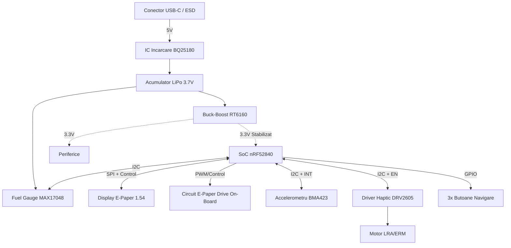

# InkTime v6 - Advanced Open Source Smartwatch

InkTime v6 este un smartwatch open-source de inalta performanta, axat pe eficienta energetica extrema si un factor de forma compact. Aceasta revizie hardware aduce imbunatatiri majore pe partea de management al energiei, feedback haptic avansat si generarea tensiunilor pentru display direct pe placa de baza.

Acest repository contine fisierele de design hardware (Schematice, PCB layout, BOM) pentru faza **EVT (Engineering Validation Test)** a versiunii 6.

## 1. Diagrama Bloc a Sistemului

## 2. Bill Of Materials (BOM)

Tabelul de mai jos contine circuitele integrate (IC-urile) principale folosite in designul placii. Lista completa se gaseste in fisierul .csv din folderul Manufacturing.
| Componenta | Rol in sistem | JLC Part # | Link Datasheet |
| :--- | :--- | :--- | :--- |
| **nRF52840-QIAA** | Microcontroller principal (BLE, Cortex-M4F) | C206001 | [Datasheet nRF52840](https://infocenter.nordicsemi.com/pdf/nRF52840_PS_v1.7.pdf) |
| **BQ25180YBGR** | IC Incarcare liniara avansata (Ultra-Low Iq) | N/A | [Datasheet BQ25180](https://www.ti.com/lit/ds/symlink/bq25180.pdf) |
| **RT6160AWSC** | Regulator DC/DC Buck-Boost 3.3V | C2836254 | [Datasheet RT6160](https://www.richtek.com/assets/product_file/RT6160A/DS6160A-02.pdf) |
| **MAX17048G+T10** | Fuel Gauge (Monitorizare Baterie prin I2C) | C113374 | [Datasheet MAX17048](https://www.analog.com/media/en/technical-documentation/data-sheets/MAX17048-MAX17049.pdf) |
| **BMA423** | Accelerometru Ultra-Low Power (Pedometer HW) | C283084 | [Datasheet BMA423](https://www.bosch-sensortec.com/media/boschsensortec/downloads/datasheets/bst-bma423-ds004.pdf) |
| **DRV2605YZFR** | Driver Haptic I2C (Generare vibratii complexe) | C63435 | [Datasheet DRV2605](https://www.ti.com/lit/ds/symlink/drv2605.pdf) |
| **USBLC6-2SC6Y** | Protectie ESD pe liniile de date si alimentare USB-C | C7519 | [Datasheet USBLC6](https://www.st.com/resource/en/datasheet/usblc6-2.pdf) |

## 3. Descrierea Functionalitatii Hardware
### Procesare si Conectivitate:

Inima ceasului InkTime este SoC-ul Nordic nRF52840. A fost ales datorita suportului nativ pentru Bluetooth 5.0 (BLE), esential pentru sincronizarea notificarilor cu telefonul mobil. Arhitectura ARM Cortex-M4F permite procesarea eficienta a algoritmilor senzorilor.
Managementul Consumului de Energie (Power Tree):

Fiind un dispozitiv wearable, constrangerile de baterie sunt critice. Sistemul energetic a fost complet reproiectat in v6.

Sistemul este alimentat de o baterie LiPo de mici dimensiuni (ex. 500mAh). Monitorizarea starii de incarcare (SoC) se face precis si fara consum mare de curent prin cipul MAX17048.

Incarcarea se face la 5V printr-un circuit BQ25180, un cip de top care permite controlul precis al pragurilor de incarcare.

Pentru a asigura tensiunea de 3.3V am folosit un convertor Buck-Boost RT6160 in loc de un LDO simplu. Acesta mentine 3.3V perfect stabil chiar si cand tensiunea bateriei scade, extragand maximum de energie din acumulator inainte de oprire.

### Periferice si Interfete:

Display-ul E-Ink: Comunica prin protocol SPI. Fata de versiunile anterioare, placa include propriul circuit de generare a tensiunilor inalte (E-Paper Drive On-Board cu inductor si mosfet), ceea ce reduce grosimea totala. Consuma 0mA pentru a mentine imaginea afisata.

Senzorii (IMU, Haptic, Fuel Gauge): Comunicatia se realizeaza pe o magistrala I2C partajata. BMA423 are un mod special de "step counter" hardware care poate trezi microcontroller-ul din sleep doar cand utilizatorul face un pas. Driver-ul DRV2605 ofera feedback haptic premium, descarcand procesorul de generarea semnalelor PWM.

## 4. Alocarea Pinilor nRF52840

Microcontroller-ul nRF52840 permite maparea flexibila a pinilor (orice functie digitala pe orice pin), lucru care a facilitat o rutare curata pe PCB.

| Pin nRF52840 | Nume Net / Functie | Justificare / Detalii |
| :--- | :--- | :--- |
| **P0.26 / P0.27** | `SDA/2.4C`, `SCL/2.4C` | Magistrala I2C principala (IMU, Haptic, Fuel Gauge, Charger). Contine rezistente de pull-up. |
| **P0.08 / P1.09** | `IMU_INT1`, `IMU_INT2` | Pini de intrerupere hardware. BMA423 trimite semnale aici pentru a trezi SoC-ul cand detecteaza miscare. |
| **P0.12** | `HAPTIC_EN` | Pin configurat ca iesire pentru a activa/dezactiva driver-ul de vibratii DRV2605. |
| **P0.04** | `EPD_CS` | Chip Select pentru activarea magistralei SPI a display-ului E-Paper. |
| **P0.13 - P0.15** | `MOSI`, `MISO`, `SCK` | Magistrala SPI hardware (rutata direct catre conectorul FPC de 24 pini). |
| **Diverse** | `SW_UP`, `SW_ENT`, `SW_DN` | Pini conectati la butoanele laterale, configurati cu retele RC (Hardware Debouncing) pentru o citire curata. |

## 5. Design Log & Integrare Mecanica
### Constructia PCB-ului:

Layout-ul este extrem de dens, folosind componente in capsule miniaturale (BGA si QFN). Rutarea respecta zona de "Keepout" a antenei de 2.4GHz, asigurand o bataie maxima a semnalului Bluetooth.
Interfete Fizice:

Conectorul USB Type-C este utilizat exclusiv pentru incarcare (5V) si a fost ranforsat mecanic. Debug-ul se face prin footprint-ul SWD standardizat (Tag-Connect TC2030).

## 6. Calcule Detaliate de Consum de Energie (Power Budget)

Dispozitivul este proiectat sa functioneze cu un acumulator LiPo de 500 mAh.
### Consum in Mod Sleep (Standby / System OFF)

    * nRF52840 (Sleep): ~1.5 uA

    * BMA423 (Low Power): ~2.0 uA

    * MAX17048 (Hibernate): ~0.5 uA

    * BQ25180 (Battery Discharge): ~10.0 uA

    * RT6160 (Quiescent): ~1.0 uA

    * Total Consum Sleep: ~15.0 uA (0.015 mA)

### Consum in Mod Activ (Actualizare Ecran / Bluetooth)

    * nRF52840 (CPU + TX RF): ~14.0 mA

    * E-Paper Drive (in timpul refresh-ului): ~8.0 mA

    * Total Consum Activ (varf): ~22.0 mA

### Estimarea Autonomiei

Presupunand un ciclu de utilizare cu 50 de treziri pe zi si o medie calculata de 0.15 mA consum hibrid:

500 mAh / 0.15 mA = 3333 ore = Aproximativ 138 de zile (peste 4 luni) teoretice cu o singura incarcare.
